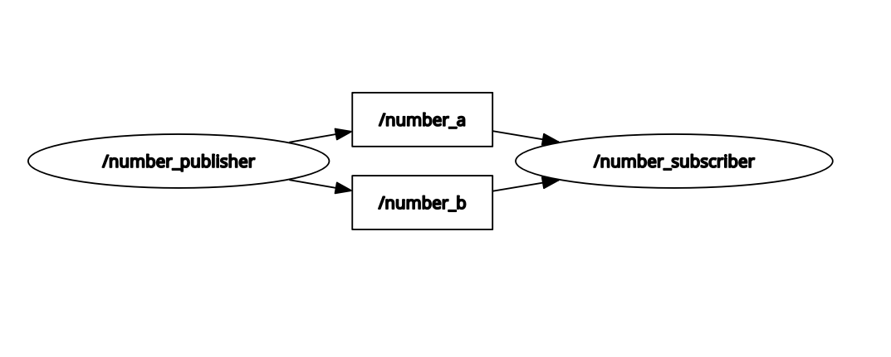

# 🎓 ROS 2 Nodes & Topics Demo

A simple way to understand ROS 2 **Nodes** and **Topics** through custom publisher and subscriber nodes.

## 📋 Overview

This package contains two simple nodes:

```
┌─────────────────────┐         /number_a         ┌─────────────────────┐
│                     │ ───────────────────────▶  │                     │
│  NUMBER PUBLISHER   │                           │  NUMBER SUBSCRIBER  │
│                     │         /number_b         │                     │
│  (Sends 2 random    │ ───────────────────────▶  │  (Calculates sum,   │
│   numbers/sec)      │                           │   diff, product)    │
│                     │                           │                     │
└─────────────────────┘                           └──────────┬──────────┘
                                                             │
                                                             │ /result
                                                             ▼
                                                      (Sum published)
```

## 🚀 Quick Start

### Build the Package

```bash
cd ~/ros2_ws
source /opt/ros/jazzy/setup.bash
colcon build --packages-select nodes_topics_demo
source install/setup.bash
```

### Run the Nodes

**Terminal 1 - Start Publisher:**
```bash
source ~/ros2_ws/install/setup.bash
ros2 run nodes_topics_demo number_publisher
```

**Terminal 2 - Start Subscriber:**
```bash
source ~/ros2_ws/install/setup.bash
ros2 run nodes_topics_demo number_subscriber
```

## 🔍 Inspecting the System

Open a **third terminal** and explore:

### List Active Nodes
```bash
ros2 node list
```
Expected output:
```
/number_publisher
/number_subscriber
```

### List Active Topics
```bash
ros2 topic list
```
Expected output:
```
/number_a
/number_b
/result
/parameter_events
/rosout
```

### Get Topic Info
```bash
ros2 topic info /number_a
```

### Echo a Topic (watch live data)
```bash
ros2 topic echo /number_a
ros2 topic echo /result
```

### View Node Info
```bash
ros2 node info /number_publisher
ros2 node info /number_subscriber
```

## 📊 Visualize with rqt_graph

```bash
rqt_graph
```

This shows a visual diagram of nodes and topics!

## 🧠 Key Concepts

### What is a Node?
A **Node** is an independent process that performs computation. In ROS 2:
- Each node has a unique name
- Nodes communicate via topics, services, or actions
- Multiple nodes can run simultaneously

### What is a Topic?
A **Topic** is a named communication channel:
- **Publishers** send messages to topics
- **Subscribers** receive messages from topics
- Multiple publishers/subscribers can use the same topic
- Communication is asynchronous (fire and forget)

### Message Types
We use `std_msgs/Float64` which contains a single `data` field of type `float64`.

```python
from std_msgs.msg import Float64

msg = Float64()
msg.data = 42.0
```

## 📁 Package Structure

```
nodes_topics_demo/
├── nodes_topics_demo/
│   ├── __init__.py
│   ├── number_publisher.py   # Publisher node
│   └── number_subscriber.py  # Subscriber node
├── resource/
│   └── nodes_topics_demo
├── package.xml
├── setup.cfg
├── setup.py
└── README.md
```

## 📝 License

MIT License
